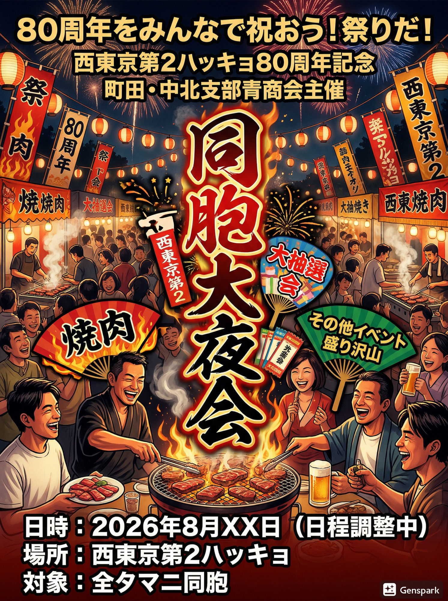

# 第16期 中北青商会 第4回会議 議事録

**日時：** 2026年4月15日  
**出席者：** 趙栄貴、朴永煥、金勇樹、李樹勇、李将玄

---

## 1. 活動報告・継続案件・財政協議

### 県青商会活動報告
- ウリカップ

### 中北青商会活動報告
- **名簿確認：** 会員および会員候補（計5名）の状態を確認
- **ウリマル教室：** 本年度も顧問（金ヒョノ）による継続実施中

### リミックス関連
- 趙栄貴、金ヨンス → ショットが入る

### 横浜本部朝青 車両財政
- 3月末までに地域5万円を検討
- リミックス 2.4万円は計上可能
- **チャンヒョン：** まとめをお願いします

---

## 2. ウリカップ（4/21・22）

### 編成（6組構成 → 5組）

| 組 | メンバー |
|----|---------|
| 1組 | 県会長、金忠学、馬大志 |
| 2組 | 趙栄貴、金ヨンス兄、金ガン |
| 3組 | 千葉青商会 |
| 4組 | 金勇樹 |
| 5組 | 朴瑛煥、李樹勇、… |

### チケット支払い
- 会長口座に振り込み、一括払い

### チケット

| 担当 | 枚数 |
|------|------|
| 金勇樹 | 13枚 |
| 李樹勇 | 1枚 |
| 朴瑛煥 | 1枚 |
| 金忠学 | 1枚 |
| 趙栄貴 | 34枚 |
| 李将玄 | 8枚 |
| 町田 | 10枚 |
| 女盟 | 5枚 |
| **合計** | **73枚** |

### 広告
- 目標：20万円
- 確定：タマニカップ 10万円
- 不足：10万円（目標未達）
- **→ 追加営業先の検討が必要**

---

## 3. 地域間連携・事業計画

- **町田との連携：** 町田会長と80周年行事に向けた協議を実施予定 → 4/1・2
- **同胞大夜会：** 町田・中北支部青商会共同主催
  - 日時：2026年8月22日
  - 場所：西東京第２ハッキョ
  - 対象：全タマニ同胞
  - 内容：焼肉、大抽選会、その他イベント
  - 位置づけ：西東京第２ハッキョ80周年記念行事

- **会員候補：** 食事会実施済
- **年間スケジュール確認：**
  - 4月：分会代表者大会
  - 5月31日：タマニ運動会
  - 6月：総連全体大会
  - 7月4日：中央総会
  - 7月5日：千葉フォーラム
  - 7月25日（仮）：30周年神奈川県総会
  - 8月22日：同胞大夜会（町田・中北支部青商会共同主催）
  - 10月：アンニョンフェスタ
  - 11月17日：タマニカップ（ゴルフ）
  - 12月：中北総会
- **新規企画：**
  - 食事会（5月、ニューモランボン）
  - OB訪問（よんなんさんのお店）実施済（趙栄貴）
  - ホームパーティー（3/28 実施済）
  - 麻雀大会（担当：朴瑛煥、6月以降で日程調整）
- **予算執行計画：** 作成済

### 予算執行計画

**前期繰越金：** ¥100,435（2026.3.16通帳分は別）

#### 収入

| 項目 | 金額 |
|------|------|
| 金勇樹 会費1年分（幹事） | ¥24,000 |
| 趙栄貴 会費1年分（幹事） | ¥24,000 |
| 李将玄 会費1年分（幹事） | ¥24,000 |
| 李樹勇 会費1年分（幹事） | ¥24,000 |
| 朴瑛煥 会費1年分（幹事） | ¥24,000 |
| 金忠学 会費半年分（幹事） | ¥12,000 |
| 張仁徳 会費1年分（会員） | ¥12,000 |
| 馬大志 会費1年分（会員） | ¥12,000 |
| 孫永拓 会費1年分（会員） | ¥12,000 |
| ユミ 会費1年分（会員） | ¥12,000 |
| 総会参加費（2025/12/14） | ¥126,000 |
| **合計** | **¥306,000** |

#### 支出

| 項目 | 金額 |
|------|------|
| 総会（2025/12/14） | ¥124,461 |
| フォーラム広告費、中央分担金 | ¥36,000 |
| 西東京第二運動会協賛金 | ¥30,000 |
| タマニカップ広告費 | ¥20,000 |
| 県幹事会会費6ヶ月分（1名分） | ¥18,000 |
| **合計** | **¥228,461** |

**収支：** ¥77,539

---

## 4. ToDo

- [ ] ウリカップチケット販売（引き続き）
- [ ] 同胞大夜会準備：町田会長と連携して進める（担当：李将玄）
- [ ] 麻雀大会の日程調整（担当：朴瑛煥、6月以降）
- [ ] ハナ大和支店 口座情報更新（担当：チャンヒョン）
- [ ] 西東京第２ハッキョ草むしり＆ニューモランボン食事会（5月24日で調整予定、担当：李樹勇）

---

*以上*
